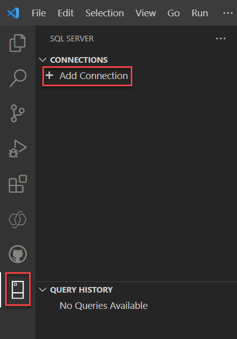
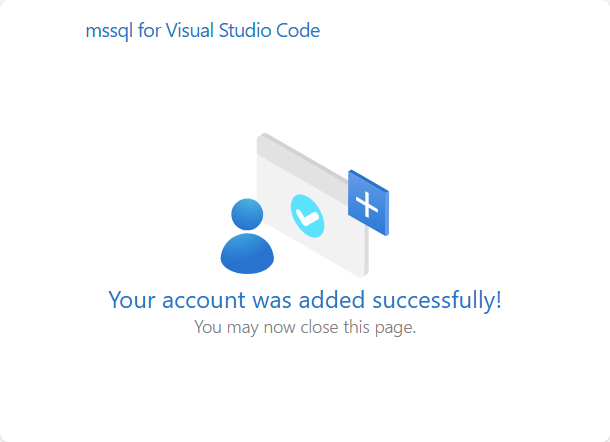
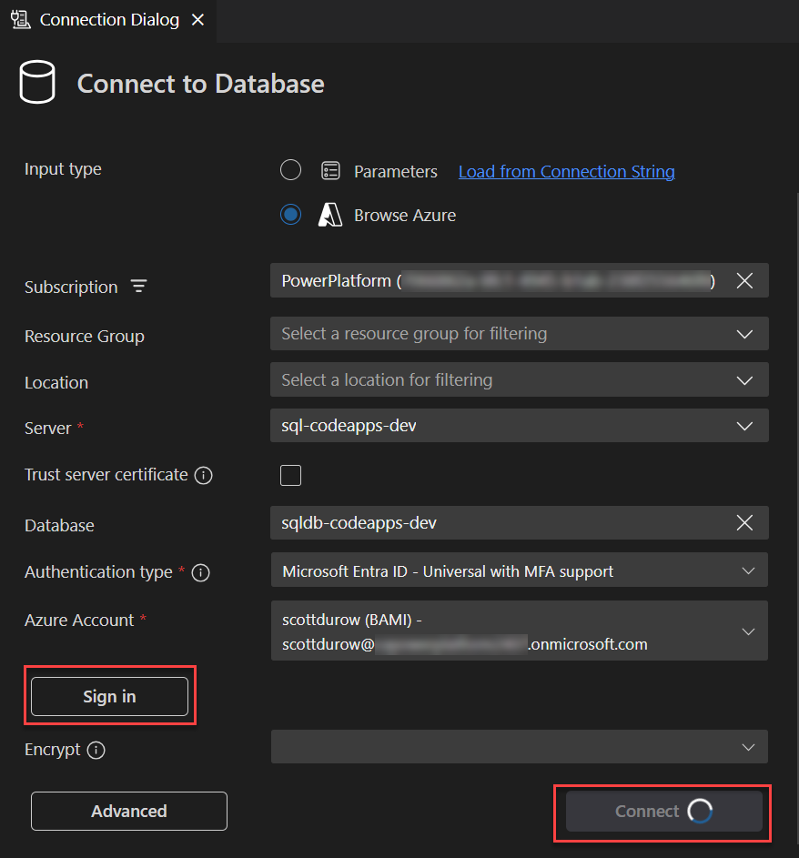
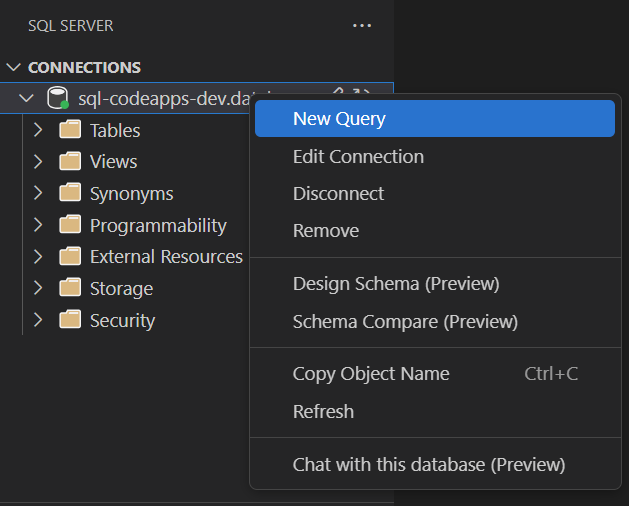
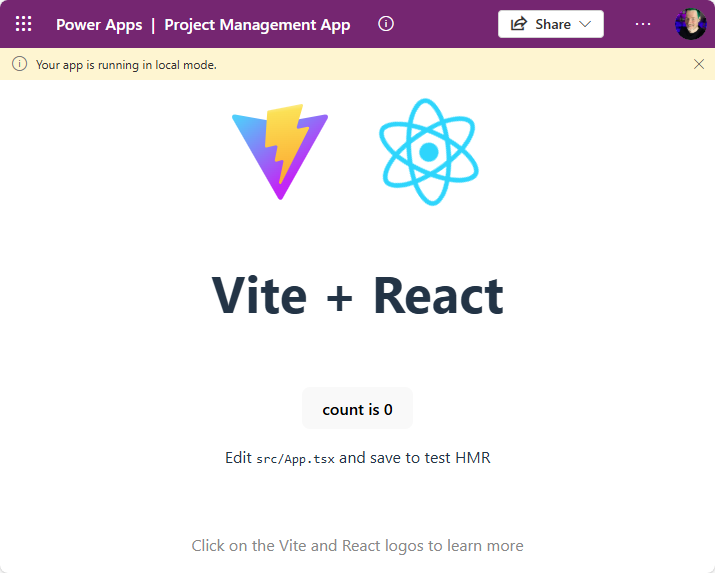
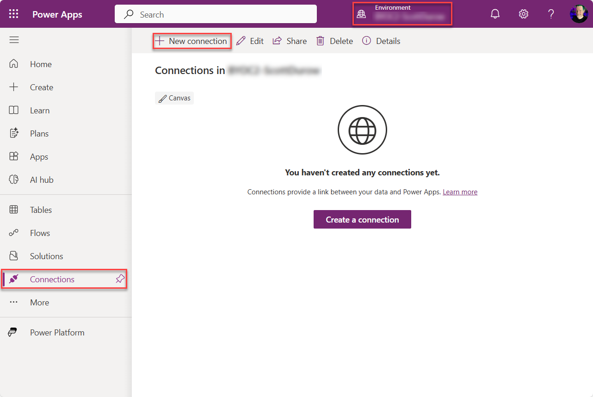
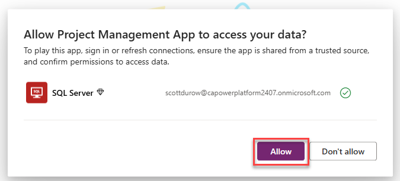
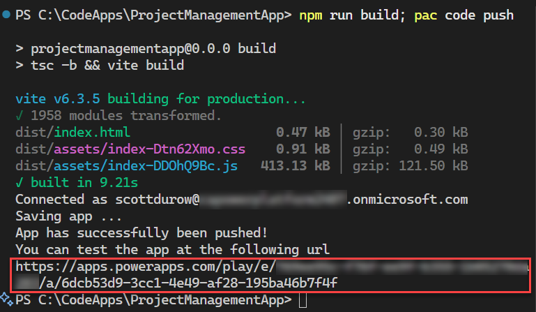

# Connect Power Apps Code Apps to Azure SQL: Full Walkthrough

This guide walks through how to set up an Azure SQL Database and connect it to a Power Apps Code App using the the Power SDK. 

This guide covers:

- Provisioning an Azure SQL Server and database
- Creating SQL tables and stored procedures
- Connecting a Power Apps Code App using the Power SDK

> [!IMPORTANT] This guide assumes you have access to the Azure Portal and a Power Apps environment with Code App capabilities enabled.

## Prerequisites

- An Azure subscription
- Access to the [Azure Portal](https://portal.azure.com)
- Power Platform environment with Code Apps enabled
- [Visual Studio Code](https://code.visualstudio.com/)
- [Node.js](https://nodejs.org/) (LTS version)
- [Power Platform Tools for VS Code](https://learn.microsoft.com/en-us/power-platform/developer/cli/introduction)

## Set Up Azure SQL Server and Database

1. Navigate to [Select SQL deployment option - Microsoft Azure](https://portal.azure.com/#create/Microsoft.AzureSQL)
1. Select **SQL database** -> Resource type: **Single database** -> **Create**
1. Fill in:
   - Resource group: Select **Create new** and enter a Resource group name, e.g. `rg-codeapps-dev`
   - Database name: `sqldb-codeapps-dev`
   - Server: Select **Create new** and Fill in:
     - Server name: `sql-codeapps-dev`
     - Location: Select the closest region to your Power Platform environment.
     - Authentication method: **Use Microsoft Entra-only authentication**
     - Set Microsoft Entra admin: Select **Set admin**, and then **Select your own user**.
   - Select **OK**
1. Compute + storage: **General Purpose - Serverless**
1. Select **Next: Networking**  
1. Fill in:
   - Connectivity method: **Public endpoint**
   - Allow Azure services and resources to access this server: **Yes**
   - Add current client IP address: **Yes**
1. Select **Review + create** -> **Create**
1. Wait until the Deployment has completed, and then select **Go to resource**

### Deploy sample data

1. Inside [Visual Studio Code](https://code.visualstudio.com/download), select Extensions (`Ctrl + Shift + X`)

1. Search for **SQL Server (mssql)** and install if you do not already have them installed.

1. Locate the SQL Server extension on the Activity Bar and open it, or use `Ctrl + Alt + D`

1. Under Connections, select **+ Add Connection**  
   

1. In the Connect to Database dialog, Select **Browse Azure**, select your Subscription, Resource group (e.g. `rg-codeapps-dev`), Server (e.g. `sql-codeapps-dev`), and then database (e.g. `sqldb-codeapps-dev` ) 

1. Under Authentication type, select **Microsoft Entra ID - Universal with MFA support**

1. Ensure you have your Azure portal open in your browser, and then select **Sign In**. You should be prompted to login, and then see:  
   

1. Select Connect  
   

1. In the SQL SERVER panel, right click on your database and select **New Query**  
   

1. In the new query window, paste the following:
   ```sql
   -- Drop existing objects if they exist
   IF OBJECT_ID('dbo.Projects', 'U') IS NOT NULL DROP TABLE dbo.Projects;
   
   -- =============================================
   -- CREATE TABLES
   -- =============================================
   
   -- Projects Table
   CREATE TABLE [dbo].[Projects](
       [ProjectId] [int] IDENTITY(1,1) NOT NULL,
       [Name] [nvarchar](255) NOT NULL,
       [Description] [nvarchar](max) NULL,
       [StartDate] [date] NULL,
       [EndDate] [date] NULL,
       [Status] [nvarchar](50) NOT NULL DEFAULT ('Planning'),
       [Priority] [nvarchar](20) NOT NULL DEFAULT ('Medium'),
       [Budget] [decimal](18, 2) NULL,
       [ProjectManagerEmail] [nvarchar](255) NOT NULL,
       [CreatedBy] [nvarchar](255) NOT NULL,
       [CreatedDate] [datetime2](7) NOT NULL DEFAULT (getutcdate()),
       [IsActive] [bit] NOT NULL DEFAULT (1),
       CONSTRAINT [PK_Projects] PRIMARY KEY ([ProjectId])
   );
   GO
   
   -- =============================================
   -- ADD CONSTRAINTS
   -- =============================================
   
   -- Project Status Check
   ALTER TABLE [dbo].[Projects] ADD CONSTRAINT [CK_Projects_Status] 
   CHECK ([Status] IN ('Planning', 'Active', 'On Hold', 'Completed', 'Cancelled'));
   
   -- Project Priority Check
   ALTER TABLE [dbo].[Projects] ADD CONSTRAINT [CK_Projects_Priority] 
   CHECK ([Priority] IN ('Low', 'Medium', 'High', 'Critical'));
   GO
   
   -- =============================================
   -- STORED PROCEDURES
   -- =============================================
   
   -- Get All Projects
   IF OBJECT_ID('dbo.GetAllProjects', 'P') IS NOT NULL DROP PROCEDURE dbo.GetAllProjects;
   GO
   CREATE PROCEDURE [dbo].[GetAllProjects]
   AS
   BEGIN
       SET NOCOUNT ON;
       
       SELECT 
           [ProjectId], [Name], [Description], [StartDate], [EndDate],
           [Status], [Priority], [Budget], [ProjectManagerEmail],
           [CreatedBy], [CreatedDate], [IsActive]
       FROM [dbo].[Projects]
       WHERE [IsActive] = 1
       ORDER BY [CreatedDate] DESC;
   END
   GO
   
   -- Create Project
   IF OBJECT_ID('dbo.CreateProject', 'P') IS NOT NULL DROP PROCEDURE dbo.CreateProject;
   GO
   CREATE PROCEDURE [dbo].[CreateProject]
       @Name NVARCHAR(255),
       @Description NVARCHAR(MAX) = NULL,
       @StartDate DATE = NULL,
       @EndDate DATE = NULL,
       @Status NVARCHAR(50) = 'Planning',
       @Priority NVARCHAR(20) = 'Medium',
       @Budget DECIMAL(18,2) = NULL,
       @ProjectManagerEmail NVARCHAR(255),
       @CreatedBy NVARCHAR(255)
   AS
   BEGIN
       SET NOCOUNT ON;
       
       INSERT INTO [dbo].[Projects] (
           [Name], [Description], [StartDate], [EndDate], 
           [Status], [Priority], [Budget], [ProjectManagerEmail], [CreatedBy]
       )
       VALUES (
           @Name, @Description, @StartDate, @EndDate,
           @Status, @Priority, @Budget, @ProjectManagerEmail, @CreatedBy
       );
       
       SELECT SCOPE_IDENTITY() as ProjectId;
   END
   GO
   
   -- Update Project
   IF OBJECT_ID('dbo.UpdateProject', 'P') IS NOT NULL DROP PROCEDURE dbo.UpdateProject;
   GO
   CREATE PROCEDURE [dbo].[UpdateProject]
       @ProjectId INT,
       @Name NVARCHAR(255) = NULL,
       @Description NVARCHAR(MAX) = NULL,
       @StartDate DATE = NULL,
       @EndDate DATE = NULL,
       @Status NVARCHAR(50) = NULL,
       @Priority NVARCHAR(20) = NULL,
       @Budget DECIMAL(18,2) = NULL,
       @ProjectManagerEmail NVARCHAR(255) = NULL
   AS
   BEGIN
       SET NOCOUNT ON;
       
       UPDATE [dbo].[Projects]
       SET 
           [Name] = ISNULL(@Name, [Name]),
           [Description] = ISNULL(@Description, [Description]),
           [StartDate] = ISNULL(@StartDate, [StartDate]),
           [EndDate] = ISNULL(@EndDate, [EndDate]),
           [Status] = ISNULL(@Status, [Status]),
           [Priority] = ISNULL(@Priority, [Priority]),
           [Budget] = ISNULL(@Budget, [Budget]),
           [ProjectManagerEmail] = ISNULL(@ProjectManagerEmail, [ProjectManagerEmail])
       WHERE [ProjectId] = @ProjectId AND [IsActive] = 1;
       
       SELECT @@ROWCOUNT as RowsAffected;
   END
   GO
   
   -- Delete Project (Soft Delete)
   IF OBJECT_ID('dbo.DeleteProject', 'P') IS NOT NULL DROP PROCEDURE dbo.DeleteProject;
   GO
   CREATE PROCEDURE [dbo].[DeleteProject]
       @ProjectId INT
   AS
   BEGIN
       SET NOCOUNT ON;
       
       UPDATE [dbo].[Projects]
       SET [IsActive] = 0
       WHERE [ProjectId] = @ProjectId AND [IsActive] = 1;
       
       SELECT @@ROWCOUNT as RowsAffected;
   END
   GO
   
   -- =============================================
   -- SAMPLE DATA
   -- =============================================
   
   -- Insert Sample Projects
   INSERT INTO [dbo].[Projects] ([Name], [Description], [StartDate], [EndDate], [Status], [Priority], [Budget], [ProjectManagerEmail], [CreatedBy]) VALUES
   ('Website Redesign', 'Complete redesign of company website with modern UI/UX', '2025-06-01', '2025-08-31', 'Active', 'High', 75000.00, 'sarah.johnson@company.com', 'admin@company.com'),
   ('Mobile App Development', 'Develop iOS and Android mobile application for customer portal', '2025-07-01', '2025-12-31', 'Planning', 'Critical', 150000.00, 'mike.chen@company.com', 'admin@company.com'),
   ('Database Migration', 'Migrate legacy database to cloud infrastructure', '2025-05-15', '2025-09-30', 'Active', 'Medium', 50000.00, 'lisa.williams@company.com', 'admin@company.com');
   GO
   
   PRINT 'Projects-only database schema created successfully with sample data!';
   ```
   
1. Select the green play icon (`Ctrl-Shift-E`) to **Execute the query**.

1. You should see no errors in the **QUERY RESULTS** output.


### Initialize your Vite App

1. Open Visual Studio Code and open a new PowerShell terminal and enter:
   ```powershell
   mkdir C:\CodeApps -Force
   cd C:\CodeApps
   npm create vite@latest ProjectManagementApp -- --template react-ts
   cd C:\CodeApps\ProjectManagementApp
   npm install
   ```

1. If you are asked, agree to install `create-vite`

1. Accept the default package name `projectmanagementapp` by pressing **Enter**.

1. If you are asked to select a framework, select **React**.

1. If you are asked to select a variant, select **TypeScript**.
   
1. At this time, the Power SDK requires the port to be 3000 in the default configuration. 

   Install the node type defintions using:

   ```powershell
   npm i --save-dev @types/node
   ```

   Open the `vite.config.ts`, and update to be:

   ```typescript
   import { defineConfig } from 'vite'
   import react from '@vitejs/plugin-react'
   import * as path from 'path'
   
   // https://vite.dev/config/
   export default defineConfig({
     base: "./",
     server: {
       host: "::",
       port: 3000,
     },
     plugins: [react()],
     resolve: {
       alias: {
         "@": path.resolve(__dirname, "./src"),
       },
     },
   });
   ```

1. **Save** the file.

1. Open the `tsconfig.app.json`, and set the value of `verbatimModuleSyntax` to be `false` . This is currently required to work with the Power SDK Generated code. (See [[Bug\] Power SDK generated code causes error with verbatimModuleSyntax enabled · Issue #14 ](https://github.com/microsoft/PowerAppsCodeApps/issues/14))

1. Enter the following to test your vite app:

   ```powershell
   npm run dev
   ```

1. The template project will start and run locally. Browse to the http://localhost:3000 address given.  
   


> [!IMPORTANT] If you do not see the port 3000, then revisit the steps above.

9. Press `Ctrl + C` to stop the local server when you have checked it runs ok.

### Initialize your Code App

1. Authenticate the Power Platform CLI against your Power Platform tenant:
   ```powershell
   pac auth create
   ```

   Login as your Power Platform account when prompted. 

> [!NOTE] You can also use the Power Platform Tools VS Code Extension to do this.

2. If you do not already have an environment, **create one** in the first release environment:

   ```powershell
   pac admin create --name 'Code Apps' --region 'unitedstatesfirstrelease' --type 'Developer'
   ```

3. **Select** your environment using:

   ```powershell
   pac env select -env <URL of your environment>
   ```

   You can also use the Power Platform Tools VS Code Extension to select the Environment

4. **Initialize** your code app using:

   ```powershell
   pac code init --displayName "Project Management App" -l "C:\CodeApps\ProjectManagementApp\public\vite.svg"
   ```

   Notice that there is now a `power.config.json` file in your project.

5. **Install** the Power SDK using:

   ```powershell
   npm install --save-dev "@pa-client/power-code-sdk@https://github.com/microsoft/PowerAppsCodeApps/releases/download/v0.0.4/7-31-pa-client-power-code-sdk-0.0.1.tgz"
   ```
> [!IMPORTANT] This SDK is currently not yet available on `npmjs.com` and must be installed from the GitHub release.

6. **Open** the `package.json`, and update the existing line:

   ```json
   "dev": "vite"
   ```

   to be:
   ```json
   "dev": "start pac code run && vite",
   ```

   Save the updated `pacakage.json`.

7. **Add a new file** under the `src` folder named `PowerProvider.tsx` and grab the code from [PowerProvider.tsx](./assets/PowerProvider.tsx)

8. **Save** the file.

9. **Open** `main.tsx` and add the following import under the existing imports:

   ```
   import PowerProvider from './PowerProvider.tsx'
   ```

10. **Update** `main.tsx`

   ```
   <StrictMode>
     <App />
   </StrictMode>,
   ```

   to be

   ```
   <StrictMode>
     <PowerProvider>
       <App />
     </PowerProvider>
   </StrictMode>,
   ```

11. **Save** the file

12. You can now test the Code App by using:
    ```
    npm run dev
    ```

    This will run the vite server, but also start the Power SDK server:  
    

13. Open the URL provided by the Power SDK Server.
    Important: Open the url in the same browser profile as your power platform tenant.

14. You should see the app open similar to:  
    

    

### Create a SQL Server Connection in Power Platform

1. Open [make.powerapps.com](https://make.powerapps.com)
1. Select your **Environment**
1. Navigate to **Connections** (It might be in the **... More menu**)
1. Select **+ New Connection**  
   
1. Select **SQL Server**
1. Select Authentication type: **Microsoft Entra ID Integrated**
1. Select **Create** and login in the popup authentication prompt

## Add SQL table connections to your app

1. First list the available connections in your environment. You should see the connection you just created:
   ```powershell
   pac connection list
   ```

   You should see a list similar to:  
   

1. To add the Projects table to the project, copy the the connection Id (the first column) and use the following command:
   ```powershell
   pac code add-data-source -a "shared_sql" -c "[CONNECTION ID]"  -d "[SQL SERVER NAME].database.windows.net,[DATASBASE NAME]" -sp "dbo.GetAllProjects"
   ```

   e.g.

   ```powershell
   pac code add-data-source -a "shared_sql" -c "f7bb6f0af75545c8afa6939a54902878"  -d "sql-codeapps-dev.database.windows.net,sqldb-codeapps-dev" -sp "dbo.GetAllProjects"
   ```

1. Open the `Services` and `Models` folder, and observer the newly generated code. 
   

### Add Table of Projects

1. We will use Fluent UI to show a table of projects, so downgrade to React 18 and install using:
   ```
   npm install react@^18.0.0 react-dom@^18.0.0 @types/react@^18.0.0 @types/react-dom@^18.0.0
   npm install @fluentui/react-components
   ```

1. Add a new file under `src` named `ProjectsTable.tsx` with the following:

   ```typescript
   /**
    * ProjectsTable Component - Displays project data from Power Platform in a sortable DataGrid
    */
   import React, { useEffect, useState, useCallback, useMemo } from 'react';
   import {
     DataGrid,
     DataGridHeader,
     DataGridRow,
     DataGridHeaderCell,
     DataGridCell,
     DataGridBody,
     TableColumnDefinition,
     TableRowId,
     Spinner,
     MessageBar,
     Badge,
     makeStyles,
     tokens,
   } from '@fluentui/react-components';
   import { GetAllProjectsService } from './Services/GetAllProjectsService';
   
   // String formatting utility for localizable messages
   const formatMessage = (template: string, params: Record<string, string | number> = {}): string => {
     return template.replace(/\{(\w+)\}/g, (match, key) => {
       const value = params[key];
       return value !== undefined ? String(value) : match;
     });
   };
   
   // Common UI messages
   const MESSAGE_STRINGS = {
     LOADING: 'Loading data...',
     NO_DATA: 'No data found.',
     GENERIC_ERROR: 'An unexpected error occurred',
     LOAD_ERROR: 'Failed to load data. Please try again.',
     PROJECT_COUNTER_SINGLE: 'Showing {count} project',
     PROJECT_COUNTER_PLURAL: 'Showing {count} projects',
     COLUMN_PROJECT_NAME: 'Project Name',
     COLUMN_DESCRIPTION: 'Description',
     COLUMN_START_DATE: 'Start Date',
     COLUMN_END_DATE: 'End Date',
     COLUMN_STATUS: 'Status',
     COLUMN_PRIORITY: 'Priority',
     ARIA_LABEL_DATA_GRID: 'Projects data grid',
   } as const;
   
   // Project data type
   type ProjectItem = {
     ProjectId?: number;
     Name?: string;
     Description?: string;
     StartDate?: string;
     EndDate?: string;
     Status?: string;
     Priority?: string;
     Budget?: number;
     ProjectManagerEmail?: string;
     CreatedBy?: string;
     CreatedDate?: string;
     IsActive?: boolean;
   };
   
   // DataGrid columns
   const COLUMNS: TableColumnDefinition<ProjectItem>[] = [
     {
       columnId: 'name',
       compare: (a, b) => (a.Name || '').localeCompare(b.Name || ''),
       renderHeaderCell: () => MESSAGE_STRINGS.COLUMN_PROJECT_NAME,
       renderCell: (item) => item.Name || '',
     },
     {
       columnId: 'description',
       compare: (a, b) => (a.Description || '').localeCompare(b.Description || ''),
       renderHeaderCell: () => MESSAGE_STRINGS.COLUMN_DESCRIPTION,
       renderCell: (item) => item.Description || '',
     },
     {
       columnId: 'startDate',
       compare: (a, b) => new Date(a.StartDate || '').getTime() - new Date(b.StartDate || '').getTime(),
       renderHeaderCell: () => MESSAGE_STRINGS.COLUMN_START_DATE,
       renderCell: (item) => item.StartDate ? new Date(item.StartDate).toLocaleDateString() : '',
     },
     {
       columnId: 'endDate',
       compare: (a, b) => new Date(a.EndDate || '').getTime() - new Date(b.EndDate || '').getTime(),
       renderHeaderCell: () => MESSAGE_STRINGS.COLUMN_END_DATE,
       renderCell: (item) => item.EndDate ? new Date(item.EndDate).toLocaleDateString() : '',
     }, {
       columnId: 'status',
       compare: (a, b) => (a.Status || '').localeCompare(b.Status || ''),
       renderHeaderCell: () => MESSAGE_STRINGS.COLUMN_STATUS,
       renderCell: (item) => <StatusBadge status={item.Status || ''} />,
     },
     {
       columnId: 'priority',
       compare: (a, b) => (a.Priority || '').localeCompare(b.Priority || ''),
       renderHeaderCell: () => MESSAGE_STRINGS.COLUMN_PRIORITY,
       renderCell: (item) => <PriorityBadge priority={item.Priority || ''} />,
     },
   ];
   
   // Row ID generator
   const getRowId = (item: ProjectItem): TableRowId =>
     item.ProjectId?.toString() || `temp-${Date.now()}-${Math.random().toString(36).substring(2, 11)}`;
   
   // Extracts a user-friendly error message from various error types
   const extractErrorMessage = (
     error: unknown,
     fallbackMessage = MESSAGE_STRINGS.GENERIC_ERROR
   ): string => {
     if (error instanceof Error) {
       return error.message;
     }
     if (typeof error === 'string') {
       return error;
     } return fallbackMessage;
   };
   
   // Badge component for Priority
   const PriorityBadge: React.FC<{ priority: string }> = React.memo(({ priority }) => {
     const styles = useStyles();
     const badgeProps = useMemo(() => {
       const getPriorityAppearance = (priority: string) => {
         switch (priority?.toLowerCase()) {
           case 'critical':
             return { appearance: 'filled' as const, color: 'danger' as const };
           case 'high':
             return { appearance: 'filled' as const, color: 'important' as const };
           case 'medium':
             return { appearance: 'filled' as const, color: 'warning' as const };
           case 'low':
             return { appearance: 'filled' as const, color: 'success' as const };
           default:
             return { appearance: 'outline' as const, color: 'subtle' as const };
         }
       };
       return getPriorityAppearance(priority);
     }, [priority]);
   
     return (
       <Badge {...badgeProps} className={styles.badge}>
         {priority || 'Unknown'}
       </Badge>
     );
   });
   
   PriorityBadge.displayName = 'PriorityBadge';
   
   // Badge component for Status
   const StatusBadge: React.FC<{ status: string }> = React.memo(({ status }) => {
     const styles = useStyles();
     const badgeProps = useMemo(() => {
       const getStatusAppearance = (status: string) => {
         switch (status?.toLowerCase()) {
           case 'completed':
             return { appearance: 'filled' as const, color: 'success' as const };
           case 'active':
             return { appearance: 'filled' as const, color: 'brand' as const };
           case 'planning':
             return { appearance: 'filled' as const, color: 'informative' as const };
           case 'on hold':
             return { appearance: 'filled' as const, color: 'warning' as const };
           case 'cancelled':
             return { appearance: 'filled' as const, color: 'danger' as const };
           default:
             return { appearance: 'outline' as const, color: 'subtle' as const };
         }
       };
       return getStatusAppearance(status);
     }, [status]);
   
     return (
       <Badge {...badgeProps} className={styles.badge}>
         {status || 'Unknown'}
       </Badge>
     );
   });
   
   StatusBadge.displayName = 'StatusBadge';
   
   // Styles
   const useStyles = makeStyles({
     container: {
       padding: tokens.spacingVerticalXXL,
     },
     loadingContainer: {
       display: 'flex',
       alignItems: 'center',
       gap: tokens.spacingHorizontalS,
       padding: tokens.spacingVerticalXXL,
     },
     messageBar: {
       marginBottom: tokens.spacingVerticalXL,
     },
     projectCounter: {
       marginBottom: tokens.spacingVerticalM,
       fontSize: tokens.fontSizeBase200,
       color: tokens.colorNeutralForeground2,
     }, dataGrid: {
       width: '100%',
     },
     badge: {
       fontSize: tokens.fontSizeBase200,
       fontWeight: tokens.fontWeightMedium,
       textTransform: 'capitalize',
     },
   });
   
   // Custom hook to fetch and manage project data
   const useProjectsData = (): {
     projects: ProjectItem[];
     loading: boolean;
     error: string | null;
     refetch: () => Promise<void>;
   } => {
     const [projects, setProjects] = useState<ProjectItem[]>([]);
     const [loading, setLoading] = useState(true);
     const [error, setError] = useState<string | null>(null);
   
     const fetchProjects = useCallback(async () => {
       try {
         setLoading(true);
         setError(null); const result = await GetAllProjectsService.GetAllProjects();
         if (result.success && result.data?.ResultSets?.Table1) {
           const projectsData = Array.isArray(result.data.ResultSets.Table1)
             ? result.data.ResultSets.Table1 as ProjectItem[]
             : [result.data.ResultSets.Table1] as ProjectItem[];
           setProjects(projectsData);
         } else {
           const errorMsg = result.error instanceof Error
             ? result.error.message
             : result.error || MESSAGE_STRINGS.LOAD_ERROR;
           setError(errorMsg);
           console.error('Failed to fetch projects:', result.error);
         }
       } catch (error) {
         const errorMessage = extractErrorMessage(error, MESSAGE_STRINGS.GENERIC_ERROR);
         setError(errorMessage);
         console.error('Error fetching projects:', error);
       } finally {
         setLoading(false);
       }
     }, []);
   
     useEffect(() => {
       fetchProjects();
     }, [fetchProjects]);
   
     return { projects, loading, error, refetch: fetchProjects };
   };
   
   // UI Components
   const LoadingSpinner: React.FC = () => {
     const styles = useStyles();
     return (
       <div className={styles.loadingContainer}>
         <Spinner size="small" />
         <span>{MESSAGE_STRINGS.LOADING}</span>
       </div>
     );
   };
   
   const ErrorMessage: React.FC<{ error: string }> = ({ error }) => {
     const styles = useStyles();
     return (
       <MessageBar intent="error" className={styles.messageBar}>
         {error}
       </MessageBar>
     );
   };
   
   const EmptyState: React.FC = () => {
     const styles = useStyles();
     return (
       <MessageBar intent="info" className={styles.messageBar} style={{ textAlign: 'center' }}>
         {MESSAGE_STRINGS.NO_DATA}
       </MessageBar>
     );
   };
   
   const ProjectCounter: React.FC<{ count: number }> = ({ count }) => {
     const styles = useStyles();
   
     const counterMessage = useMemo(() => {
       return count === 1
         ? formatMessage(MESSAGE_STRINGS.PROJECT_COUNTER_SINGLE, { count })
         : formatMessage(MESSAGE_STRINGS.PROJECT_COUNTER_PLURAL, { count });
     }, [count]);
   
     return (
       <div className={styles.projectCounter}>
         {counterMessage}
       </div>
     );
   };
   
   // Main component
   const ProjectsTable: React.FC = () => {
     const styles = useStyles();
     const { projects, loading, error } = useProjectsData();
     const projectCount = useMemo(() => projects.length, [projects.length]);
     const memoizedProjects = useMemo(() => projects, [projects]);
     const dataGridProps = useMemo(() => ({
       items: memoizedProjects,
       columns: COLUMNS,
       sortable: true,
       getRowId,
       focusMode: "cell" as const,
       className: styles.dataGrid,
       "aria-label": MESSAGE_STRINGS.ARIA_LABEL_DATA_GRID,
     }), [memoizedProjects, styles.dataGrid]);
   
     if (loading) {
       return (
         <div className={styles.container}>
           <LoadingSpinner />
         </div>
       );
     }
   
     if (error) {
       return (
         <div className={styles.container}>
           <ErrorMessage error={error} />
         </div>
       );
     }
   
     if (projectCount === 0) {
       return (
         <div className={styles.container}>
           <EmptyState />
         </div>
       );
     }
     return (
       <div className={styles.container}>
         <ProjectCounter count={projectCount} />      <DataGrid {...dataGridProps}>
           <DataGridHeader>
             <DataGridRow>
               {({ renderHeaderCell }) => (
                 <DataGridHeaderCell>{renderHeaderCell()}</DataGridHeaderCell>
               )}
             </DataGridRow>
           </DataGridHeader>
           <DataGridBody<ProjectItem>>
             {({ item, rowId }) => (
               <DataGridRow<ProjectItem> key={rowId}>
                 {({ renderCell }) => (
                   <DataGridCell>{renderCell(item)}</DataGridCell>
                 )}
               </DataGridRow>
             )}
           </DataGridBody>
         </DataGrid>
       </div>
     );
   };
   
   export default React.memo(ProjectsTable);
   
   ```

1. Add the `FluentProvider` and `ProjectsTable` to `maint.tsx`:

   ```typescript
    import { StrictMode } from 'react'
    import { createRoot } from 'react-dom/client'
    import './index.css'
    import PowerProvider from './PowerProvider.tsx'
    import { FluentProvider, webLightTheme } from '@fluentui/react-components'
    import ProjectsTable from './ProjectsTable.tsx'

    createRoot(document.getElementById('root')!).render(
      <StrictMode>
        <PowerProvider>
          <FluentProvider theme={webLightTheme}>
            <ProjectsTable />
          </FluentProvider>
        </PowerProvider>
      </StrictMode>,
    )
   
   ```

1. Run your app using:

   ````
   npm run dev
   ````

   In the command window that opens up, open the app link provided:  
   

   

1. When the app opens, you should see a consent dialog, select **Allow**  
   

1. You should see data grid of projects:   
   

### Publishing the App to Power Apps

1. Once your app is ready for publishing and sharing, make sure the Vite server is stopped using `Ctrl + C`, then use the following PowerShell:
   ```
   npm run build
   pac code push
   ```

1. Open the app using the link provided to test it out!   
   

## Troubleshooting

This section covers common issues you might encounter while setting up Power Apps Code Apps with Azure SQL Database.

### Azure SQL Database Issues

#### Cannot Connect to Azure SQL Database

**Symptoms:**
- Connection timeout errors
- Authentication failures when connecting from VS Code SQL extension

**Solutions:**

1. **Check Firewall Settings:**
   - In Azure Portal, navigate to your SQL Server
   - Go to **Security** → **Networking**
   - Ensure "Allow Azure services and resources to access this server" is set to **Yes**
   - Add your current client IP address to the firewall rules

2. **Verify Authentication Method:**
   - Ensure you're using **Microsoft Entra ID - Universal with MFA support** in VS Code
   - Make sure you're signed into the same Azure account in both Azure Portal and VS Code
   - Try signing out and back in to refresh authentication tokens

3. **Check Network Connectivity:**
   ```powershell
   # Test connectivity to SQL Server
   Test-NetConnection -ComputerName "your-sql-server.database.windows.net" -Port 1433
   ```

#### SQL Query Execution Errors

**Symptoms:**
- Permission denied errors when executing SQL scripts
- Object already exists errors

**Solutions:**

1. **Permission Issues:**
   - Ensure your user account is set as the Azure AD admin for the SQL Server
   - Verify you have `db_owner` or appropriate permissions on the database

2. **Object Exists Errors:**
   - The SQL script includes `DROP` statements - these are safe to run multiple times
   - If you get constraint errors, run the drop statements individually first

### Node.js and npm Issues

#### Port 3000 Already in Use

**Symptoms:**
- "EADDRINUSE: address already in use :::3000"
- Vite server won't start

**Solutions:**

1. **Kill Existing Process:**
   ```powershell
   # Find process using port 3000
   netstat -ano | findstr :3000
   # Kill the process (replace PID with actual process ID)
   taskkill /PID [PID] /F
   ```

2. **Use Alternative Port:**
   - Update `vite.config.ts` to use a different port
   - Update Power SDK configuration accordingly

#### Package Installation Failures

**Symptoms:**
- npm install errors
- Module not found errors

**Solutions:**

1. **Clear npm Cache:**
   ```powershell
   npm cache clean --force
   npm install
   ```

2. **Delete node_modules and Reinstall:**
   ```powershell
   Remove-Item -Recurse -Force node_modules
   Remove-Item package-lock.json
   npm install
   ```

3. **Node Version Issues:**
   ```powershell
   # Check Node version
   node --version
   # Should be LTS version (18.x or 20.x)
   ```

#### Runtime Connection Errors

**Symptoms:**
- "Failed to load data" in the React app
- Connection refused errors

**Solutions:**

1. **Check Power Platform Connection:**
   - Verify the SQL Server connection is working in Power Platform
   - Test the connection in Power Platform maker portal

2. **Consent Issues:**
   - Ensure you've given consent when the app first loads
   - Clear browser cache and try again

3. **Environment Mismatch:**
   - Verify you're running the app in the same environment where the connection was created
   - Check that the browser profile matches your Power Platform account
