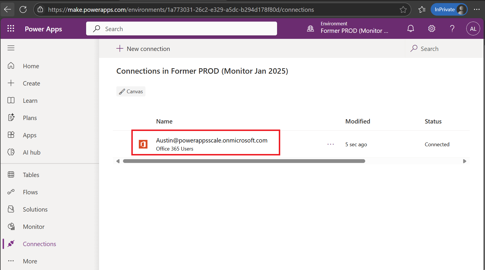
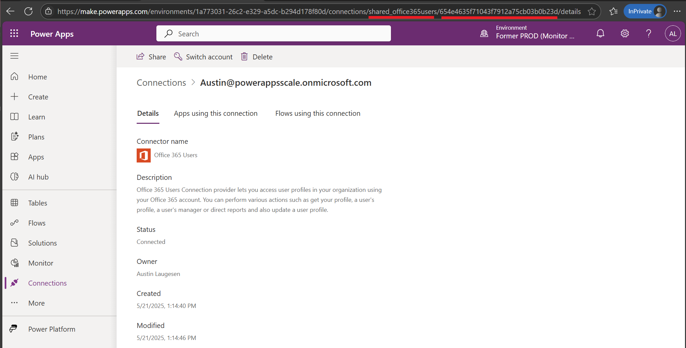

# Connect a code app to data 🔌

Code apps enable connecting to Power Platform connectors. To do this, you will create connections, add them to the app, and update the app to call them.

Note that these steps require that you have completed the Getting Started section and already initialized the app with “pac code init”.

> [!IMPORTANT] For the initial release, only SQL, SharePoint, and Office 365 Users connectors are formally supported. Other connectors (e.g. SharePoint) are expected to work but are untested. Dataverse is explicitly not supported, yet.

# Table of Contents

1. [Create and set up connections in Maker Portal](#1-create-and-set-up-connections-in-maker-portal)
2. [Create and set up connections](#2-create-and-set-up-connections)
3. [Update the app to call connections](#3-update-the-app-to-call-connections)

## 1. Create and set up connections in Maker Portal

You will need to start by creating and configuring connections at <https://make.powerapps.com> and you’ll need to copy connection metadata from there for use in later steps.

> [!IMPORTANT] For the initial release, you can only configure code apps to use existing connections that have already been pre-created in the make.powerapps.com. You cannot create new connections through PAC CLI commands. Support for creating new connections will be added in a future release.

### 1. Launch the Maker Portal Connections page

Go to <https://make.powerapps.com> and navigate to the Connections page from the left-hand navigation.


### 2. Create an Office 365 Users connection

Click “+ New connection” and select Office 365 Users. Click “Create”.

> [!NOTE] If you already have an Office 365 Users connection, you can use that instead of creating a new one.


### 3. (Optional) Create a SQL connection (or a connection for another tabular data source)

> **Tip:** For a step-by-step guide to connecting your code app to Azure SQL, see [docs/how-to-connect-to-azure-sql.md](docs/how-to-connect-to-azure-sql.md).

### 4. Get connection metadata for all created connections

You can use the Power Apps CLI to list your available connections and retrieve their IDs:

```bash
pac connection list
```

This command will display a table of all your connections, including the **Connection ID** and **API Name** (which is used as the appId when adding a data source).


You can also retrive this using the maker portal:





Copy the API name and the connection ID from PAC CLI the URL for each connection:

## 2. Create and set up connections

Once you have created or identified existing connections to use and copied the connection metadata from the previous step, you will now add those connections to the app.

Adding the data sources to the app will automatically generate a strongly typed Typescript model and service file in the repo. For example, the Office 365 Users data source will produce Office365UsersModel and Office365UsersService.

### 1. Add a non-tabular data source (e.g. Office 365 Users) to the app

From a command line, run the following. Use the API name and connection ID collected from Step #2 above.

```bash
pac code add-data-source -a <apiName> -c <connectionId>  
```

Example

```bash
pac code add-data-source -a "shared_office365users" -c "aa35d97110f747a49205461cbfcf8558"
```

>[!NOTE] If you observe a PAC CLI 403 error whent attempting to add a data source, which you have access to, it's expected to be a result of not using a first release environment as guided above.
> 

### 2. (Optional) Add a tabular data source (e.g. SQL, SharePoint) to the app

From a command line, run the following. Use the API name and connection ID collected from Step #2 above.

>[!NOTE] You will additionally need to pass a table ID and dataset name, which is controlled by the schema of your tabular data source. If you don’t already have these, instructions on how to find it are below.

```bash
pac code add-data-source -a <apiName> -c <connectionId> -t <tableId> -d <datasetName> 
```

Examples

```bash
pac code add-data-source -a "shared_sql" -c "c9a56bae5dcb43f7ac086a2fc86fd33c" -t "[dbo].[MobileDeviceInventory]" -d "paconnectivitysql0425.database.windows.net,paruntimedb"

pac code add-data-source -a "shared_sql" -c "c9a56bae5dcb43f7ac086a2fc86fd33c" -t "[dbo].[EmployeeInformation]" -d "paconnectivitysql0425.database.windows.net,paruntimedb" 
```

>[!IMPORTANT] The following steps to retrieve a dataset name and table id are a temporary workaround. We plan to add an easier mechanism to get these values.

If you don’t already have the table and dataset name, you will have to get them by running a canvas app and copying the values from the browser network inspector:

1. Create a new canvas app in Studio.
2. Add the connection to a canvas app.
3. Bind the connection to a gallery control.
4. Publish and run the app.
5. Open your browser’s Developer Tools, go to the Network tab, and inspect requests made when the app loads. Check the “invoke” request, and go to its response.
6. Find an APIM request with the connection ID, dataset name, and table ID, and copy those values.

Example data request URL through APIM. The bolded sections are the **connection ID**, **dataset name** and **table ID**.

https[]()://0aa4969d-c8e7-e0a7-9bf8-6925c5922de3.01.common.tip1002.azure-apihub.net/apim/sharepointonline/**ad4035b2c5d6496d9ad095d2b134a5e6**/datasets/**https%253A%252F%252Fauroratstgeo.sharepoint.com%252Fsites%252FTEST_Aurora_TST**/tables/**d1709e17-387c-4f02-89b9-19a0421a841a**/items

| property      | example value                                                                 |
|---------------|-------------------------------------------------------------------------------|
| connection ID | ad4035b2c5d6496d9ad095d2b134a5e6                                              |
| dataset name  | https%253A%252F%252Fauroratstgeo.sharepoint.com%252Fsites%252FTEST_Aurora_TST |
| table ID      | d1709e17-387c-4f02-89b9-19a0421a841a    |

### 3. (Optional) Add a SQL stored procedure as a data source

From a command line, run the following. Use the API name and connection ID collected from Step #2 above.

```bash
pac code add-data-source -a <apiId> -c <connectionId> -d <dataSourceName> -sp <storedProcedureName> 
```

Example

```bash
pac code add-data-source –a "shared_sql" -c "c9a56bae5dcb43f7ac086a2fc86fd33c" -d "paconnectivitysql0425.database.windows.net,paruntimedb" -sp "[dbo].[GetRecordById]" 
```

### 4. (Optional) If needed, you can delete data sources after adding

From a command line, run the following. Use the API name and connection ID collected from Step #2 above.

```bash
pac code delete-data-source -a <apiName> -ds <dataSourceName> 
```

Example

```bash
pac code delete-data-source -a "shared_sql" -ds "MobileDeviceInventory" 
```

>[!IMPORTANT] If the schema on a connection changes, there is no command to refresh the strongly typed model and service files. To do this, delete the data source and re-add it.

## 3. Update the app to call connections

Once connections are added, you can update the app to use the generated model and service.

>[!NOTE] These changes can also be made via with an IDE’s agent. For instance, in Visual Studio Code you may use Github Copilot agent mode to make them for you after the data sources have been added.

### 1. Update the app to use the non-tabular data source (e.g. Office 365 Users)

You can see the generated files under the src/Models and src/Services folders for the strongly typed connection API.

```code
await Office365UsersService.MyProfile() 
```

```code
 const profile = (await Office365UsersService.MyProfile_V2("id,displayName,jobTitle,id,userPrincipalName")).data; 
    setUser(profile); 
    if (profile?.id || profile?.userPrincipalName) { 
      // Try both id and userPrincipalName for photo 
      let photoData = null; 
      try { 
        photoData = (await Office365UsersService.UserPhoto_V2(profile.id || profile.userPrincipalName)).data; 
      } catch { 
        // fallback to userPrincipalName if id fails 
        if (profile.userPrincipalName) { 
          photoData = (await Office365UsersService.UserPhoto_V2(profile.userPrincipalName)).data; 
        } 
      } 
      if (photoData) setPhoto(`data:image/jpeg;base64,${photoData}`); 
```

### 2. (Optional) Update the app to use the tabular data source (e.g. SQL)

You can see the generated files under the src/Models and src/Services folders for the strongly typed connection API.

Example

```code
await MobileDeviceInventoryService.create(<record>) 
await MobileDeviceInventoryService.update(id, <record>) 
await MobileDeviceInventoryService.delete(id) 
await MobileDeviceInventoryService.get(id) 
await MobileDeviceInventoryService.getall() 
```

```code
await MobileDeviceInventoryService.update(assetId, changedFields); 
setAssets((prevAssets) => 
  prevAssets.map((asset) => { 
    if (asset.id === assetId) { 
```

### 3. Run the app locally to verify changes

```bash
npm run dev
```

### 4. Push the app to run on Power Apps

```bash
npm run build | pac code push
```
