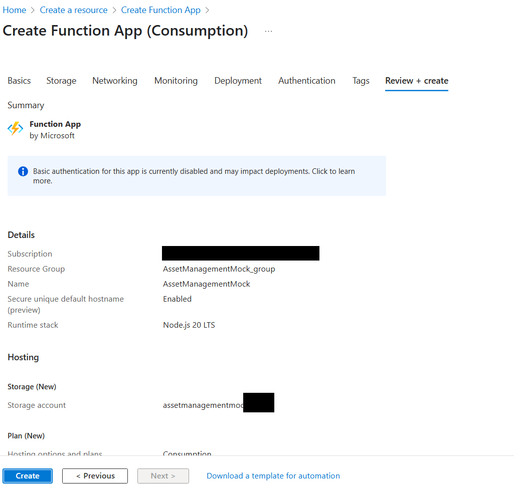
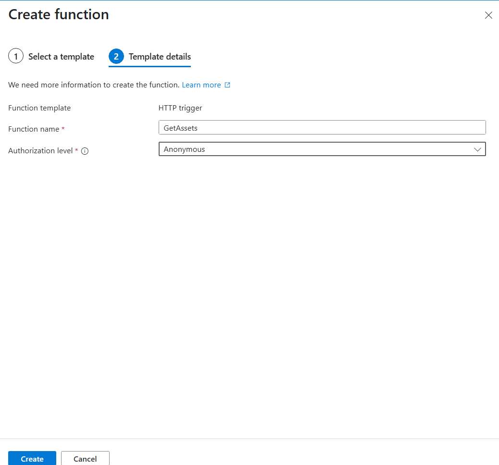
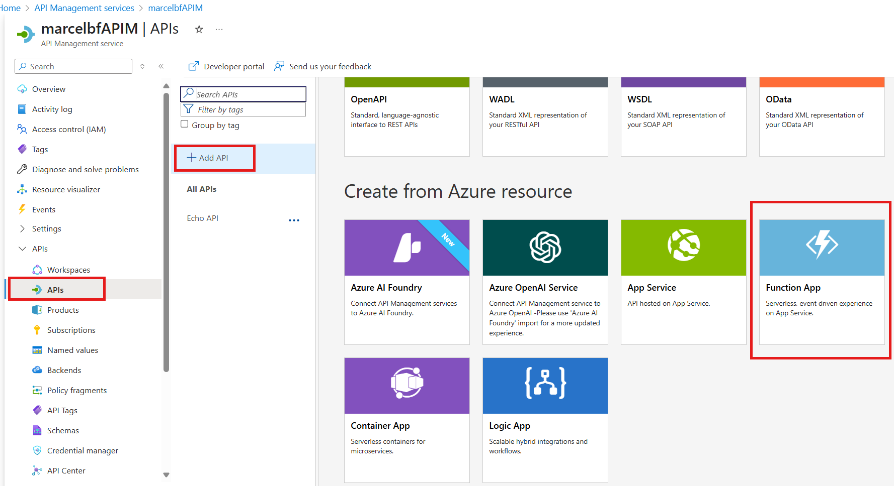
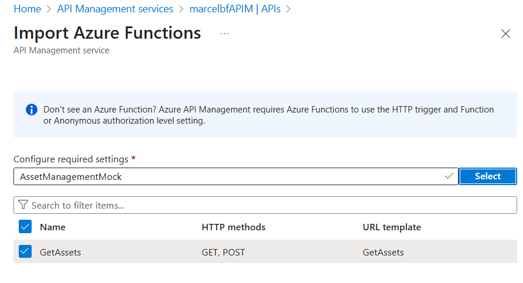
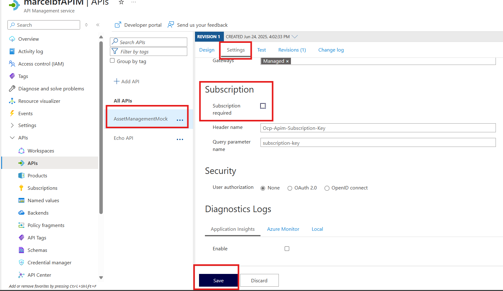
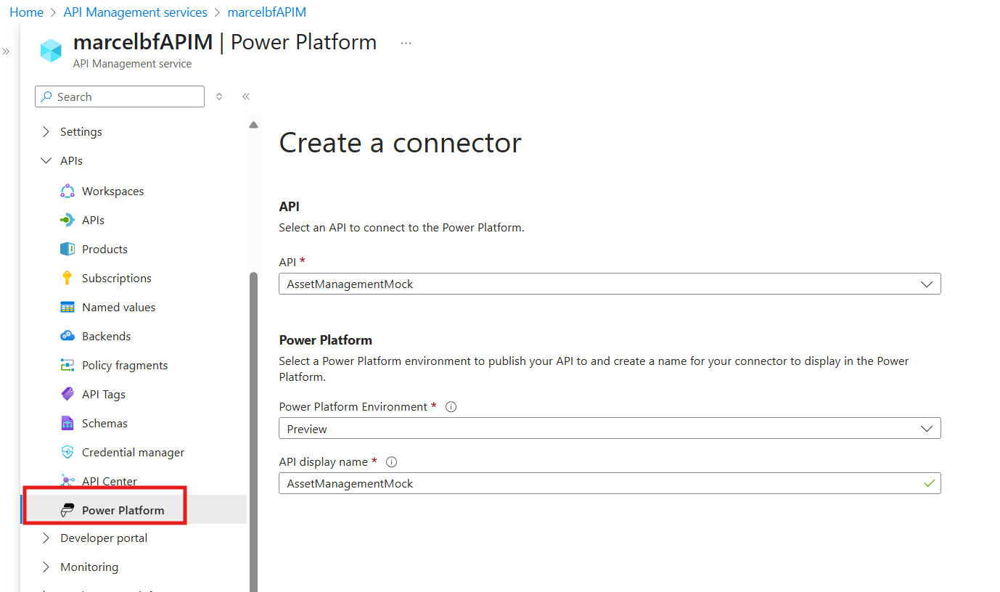
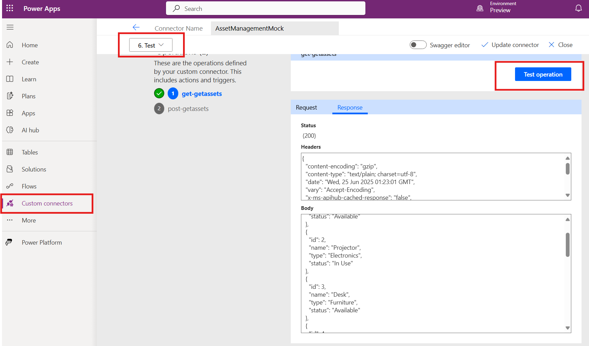

# Creating a Simple Asset Management API with Azure Functions

This guide walks you through creating a simple mock API for an asset management application using Azure Functions. The API will expose a single operation to return a list of assets. You will also learn how to create a custom connector in Power Platform using API Management.


## Prerequisites
- Azure account (a free plan is sufficient; you can use the [Azure Free Account](https://azure.microsoft.com/free/))
- [VS Code](https://code.visualstudio.com/) (optional, but recommended)

## 1. Create a New Azure Function in the Azure Portal 

1. Go to the [Azure Portal](https://portal.azure.com/).
2. Click **Create a resource** > **Web** > **Function App**.
3. Select **Consumption**.
4. Fill in the required details:
   - **Subscription**: Select your subscription.
   - **Resource Group**: Create a new one or use an existing one.
   - **Function App name**: Choose a unique name.
   - **Runtime stack**: Node.js
   - **Region**: Choose a region close to you.
5. Click **Review + create** and then **Create**.



6. Once deployment is complete, go to your new Function App.
7. Select **Create function**.
8. If asked, select: **Development environment: Develop in portal**.
9. Select **HTTP trigger** as the template, give it the name `GetAssets`, and set **Authorization level** to **Anonymous** (no authentication required).


10. Click **Create** to create the function.
11. In the **Code + Test** tab, replace the function code with the mock API code from the next section.
12. Click **Save**.

## 2. Implement the Mock API

Edit `GetAssets/index.js` to return a mock list of assets:

```js
module.exports = async function (context, req) {
    context.res = {
        // status: 200, /* Defaults to 200 */
        body: [
            { id: 1, name: "Laptop", type: "Electronics", status: "Available" },
            { id: 2, name: "Projector", type: "Electronics", status: "In Use" },
            { id: 3, name: "Desk", type: "Furniture", status: "Available" },
            { id: 4, name: "Office Chair", type: "Furniture", status: "In Use" },
            { id: 5, name: "Monitor", type: "Electronics", status: "Available" },
            { id: 6, name: "Whiteboard", type: "Office Supply", status: "Available" },
            { id: 7, name: "Phone", type: "Electronics", status: "In Use" },
            { id: 8, name: "Tablet", type: "Electronics", status: "Available" },
            { id: 9, name: "Printer", type: "Electronics", status: "Maintenance" },
            { id: 10, name: "Filing Cabinet", type: "Furniture", status: "Available" }
        ]
    };
};
```

## 3. Expose Your Function App via API Management

1. In the Azure Portal, search for and select **API Management services**.
2. Click **+ Create** to create a new API Management instance (the Developer tier is free for development/testing).
3. Fill in the required details and deploy the instance.
4. Once deployed, open your API Management instance.
5. In the left menu, select **APIs** > **+ Add API** > **Function App**.

6. Select your Function App and the `GetAssets` function. 

7. Complete the wizard to import your function as an API operation.
8. After import, go to your API in API Management.
9. In the top menu, select **Settings** for your API.
10. Under **Security**, set **Subscription required** to **Off**. This will remove the need for a subscription key (API key) when calling the API.

11. Save your changes.

## 4. Create a Custom Connector in Power Platform Using API Management (from Azure Portal)

1. In **API Management Services** In the left menu within APIs, select **Power Platform** 
2. Select **Create a connector**.
3. Select Your API

4. Select your environment, display name and select **Create**. The custom connector will be created in your selected environment.
5. In the [Power Apps maker portal](https://make.powerapps.com/), go to **Custom connectors** to review, edit, and test your new connector.


## 5. Next Steps
- Expand the API with more operations as needed. Don't forget to update the connector with the new operations when you do.
- Secure your API if you move beyond development/testing.

---
This simple API provides a mock asset list and is ready for integration with Power Platform using a custom connector via API Management.
