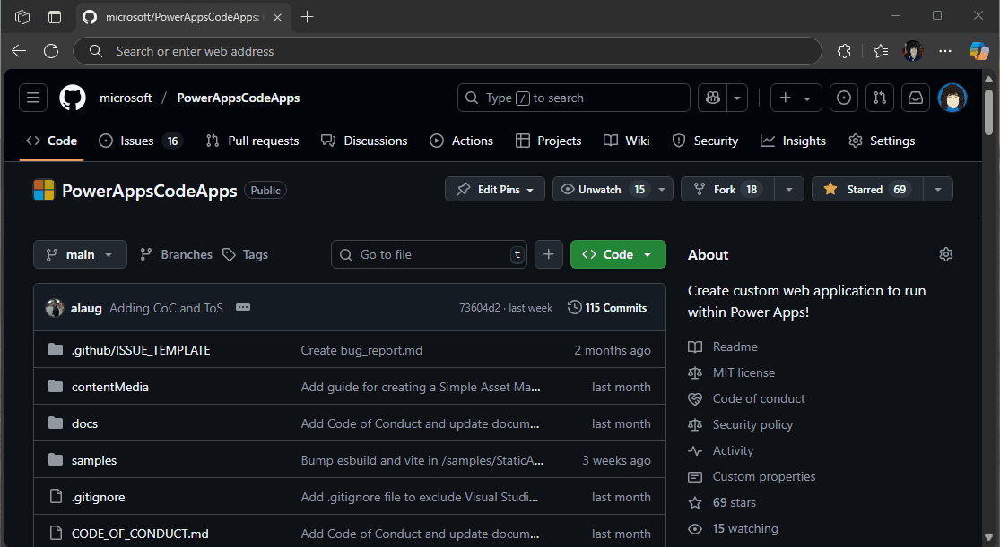

# 🌟 FluentSample - Power Apps Code Apps Template

A comprehensive Power Apps Code Apps template showcasing Fluent UI components, navigation patterns, and connector integrations. Built with GitHub Copilot and designed as a learning resource for developers.

## 🎯 What's Included

This template demonstrates:
- **Office 365 Integration** - User profiles, calendar events, and email management
- **SQL Database Connectivity** - Projects, tasks, and employee data with pagination
- **Custom API Connectors** - Asset management with REST API patterns
- **Modern UI Components** - Fluent UI v9 with responsive design
- **Navigation & Routing** - Multi-page app with sidebar navigation

## 📋 Prerequisites

- **Visual Studio Code** with [Power Platform Tools extension](https://marketplace.visualstudio.com/items?itemName=microsoft-IsvExpTools.powerplatform-vscode)
- **Power Apps environment** with Code Apps enabled - [Create a first release environment](../../README.md#create-a-first-release-power-platform-environment)
- **Node.js** (LTS version) and **npm**
- **Git** for version control
- **Power Apps CLI** (`pac` command available)

> [!IMPORTANT]
> **Before connecting to real data, be sure to:**
> 
> - **Create a connection for your Office 365 account** - [How to connect to data](../../docs/how-to-connect-to-data.md)
> - **Create a connection for your SQL Database** - [How to connect to Azure SQL](../../docs/how-to-connect-to-azure-sql.md)  
> - **Create a custom connector and connection** - [How to create sample API and custom connector](../../docs/how-to-create-api-and-custom-connector.md)

---

# Getting Started 🚀

## 1. Clone this repository and open in VS Code

```bash
git clone https://github.com/microsoft/PowerAppsCodeApps.git
cd PowerAppsCodeApps
code .
```

**Important**: Make sure you have the Power Platform Tools extension installed and configured in VS Code:
- Open the Power Platform panel in VS Code (View → Command Palette → "Power Platform")
- Ensure you're **logged in** to your Power Platform account
- Verify the **correct environment** is selected (the one with Code Apps enabled)



## 2. Install dependencies and build

Open the VS Code terminal (Terminal → New Terminal) and navigate to the FluentSample folder:

```bash
cd samples/FluentSample
npm install
npm run build
```

This ensures the project compiles successfully before running.

## 3. Initialize Power Apps Code integration

```bash
pac code init
```

This sets up the Power Apps Code integration for local development.

## 4. Run locally

```bash
npm run dev
```

This will start both Vite dev server and PAC Code Run automatically for local development and testing.


## 5. Deploy to Power Apps (Optional)

```bash
pac code push
```

This deploys your app to the Power Apps environment. If successful, this command will return a Power Apps URL where others can access your app.

Optionally, you can navigate to https://make.powerapps.com to see the app in the Maker Portal.

---

# 📊 Connecting to Real Data

This template uses mock data by default. Follow these guides to connect to real data sources:

## 🏢 How to Connect to Office 365

### Prerequisites
- Office 365 business account
- Power Apps environment with Office 365 connectors enabled


### Use GitHub Copilot to connect with Office 365:


#### Manual Steps

1. **Create Office 365 Connection**
   ```bash
   # Navigate to Power Apps Maker Portal
   # Go to Data > Connections > New Connection
   # Select "Office 365 Users", "Office 365 Outlook", etc.
   ```

2. **Update the Office 365 Page**
   
   Replace mock data in `src/pages/Office365Page.tsx`:
   
   ```typescript
   // Before (mock data)
   import { mockUsers, mockCalendarEvents, mockEmails } from '../mockData/office365Data';
   
   // After (real connector)
   import { useConnector } from '@pa-client/power-code-sdk';
   
   // Use Office 365 connector
   const office365 = useConnector('office365users');
   const outlook = useConnector('office365outlook');
   ```

3. **Replace Service Calls**
   ```typescript
   // Example: Get real users
   const loadUsers = async () => {
     try {
       const response = await office365.getUserProfiles();
       setUsers(response.data);
     } catch (error) {
       console.error('Failed to load users:', error);
     }
   };
   ```

4. **Update Mock Data Structure**
   - Review `src/mockData/office365Data.ts` for data structure
   - Ensure real API responses match the interface definitions
   - Update TypeScript interfaces if needed

---

## 🛢️ How to Connect to SQL Database

### Prerequisites
- Azure SQL Database or SQL Server
- SQL connector enabled in your Power Apps environment
- Database connection string and credentials

### Steps

1. **Create SQL Connection**
   ```bash
   # In Power Apps Maker Portal:
   # Data > Connections > New Connection > SQL Server
   # Enter server details and authentication
   ```

2. **Update SQL Page**
   
   Replace mock data in `src/pages/SqlPage.tsx`:
   
   ```typescript
   // Before (mock data)
   import { mockProjects, mockTasks, mockEmployees } from '../mockData/sqlData';
   
   // After (real connector)
   import { useConnector } from '@pa-client/power-code-sdk';
   
   const sqlConnector = useConnector('sql');
   ```

3. **Replace Database Queries**
   ```typescript
   // Example: Get real projects with pagination
   const loadProjects = async (skip: number = 0, take: number = 10) => {
     try {
       const response = await sqlConnector.getTable('Projects', {
         skip,
         take,
         orderBy: 'CreatedDate desc'
       });
       setProjects(response.data);
       setTotalCount(response.totalCount);
     } catch (error) {
       console.error('Failed to load projects:', error);
     }
   };
   ```

4. **Database Schema Example**
   ```sql
   -- Projects table
   CREATE TABLE Projects (
     Id INT PRIMARY KEY IDENTITY,
     Name NVARCHAR(255) NOT NULL,
     Description NVARCHAR(MAX),
     Status NVARCHAR(50),
     CreatedDate DATETIME2 DEFAULT GETDATE(),
     DueDate DATETIME2,
     AssignedTo INT FOREIGN KEY REFERENCES Employees(Id)
   );
   
   -- Tasks table  
   CREATE TABLE Tasks (
     Id INT PRIMARY KEY IDENTITY,
     ProjectId INT FOREIGN KEY REFERENCES Projects(Id),
     Title NVARCHAR(255) NOT NULL,
     Description NVARCHAR(MAX),
     Priority NVARCHAR(20),
     Status NVARCHAR(50),
     AssignedTo INT FOREIGN KEY REFERENCES Employees(Id),
     CreatedDate DATETIME2 DEFAULT GETDATE()
   );
   ```

### 🔍 SQL Operations Available
- **Select**: Query tables with filtering and pagination
- **Insert**: Create new records
- **Update**: Modify existing records  
- **Delete**: Remove records
- **Stored Procedures**: Execute custom database logic

---

# 📁 Project Structure

```
src/
├── components/              # Reusable UI components
│   ├── Layout.tsx          # Main layout with navigation
│   ├── PageHeader.tsx      # Page header component
│   └── PaginationComponent.tsx # Data pagination
├── pages/                  # Route components  
│   ├── HomePage.tsx        # Landing page overview
│   ├── Office365Page.tsx   # Office 365 connector demo
│   ├── SqlPage.tsx         # SQL database demo
│   └── CustomApiPage.tsx   # Custom API connector demo
├── mockData/               # Mock data for development
│   ├── office365Data.ts    # Office 365 mock data
│   ├── sqlData.ts          # SQL mock data
│   └── customApiData.ts    # Custom API mock data
├── App.tsx                 # Main app with routing
├── main.tsx                # Entry point with providers
└── PowerProvider.tsx       # Power Apps SDK setup
```

# 🛠 Technology Stack

- **React 18** + **TypeScript** - Modern React development
- **Vite** - Fast build tool and dev server  
- **Fluent UI v9** - Microsoft design system
- **React Router v6** - Client-side routing
- **TanStack Query v5** - Server state management
- **Power Apps Code SDK** - Power Platform integration

# 📚 Learning Resources

- [Power Apps Code Apps Docs](https://docs.microsoft.com/power-apps/code-apps)
- [Fluent UI React v9](https://react.fluentui.dev/)
- [Office 365 Connectors](https://docs.microsoft.com/connectors/office365/)
- [SQL Server Connector](https://docs.microsoft.com/connectors/sql/)

# 💡 Tips for Development

## GitHub Copilot Integration
This template was built with GitHub Copilot assistance. For best results:
- Use descriptive comments to guide Copilot
- Leverage Copilot for boilerplate code generation
- Ask Copilot to explain Power Apps patterns

## Mock Data to Real Data Migration
- Start with mock data to understand patterns
- Replace one connector at a time
- Test thoroughly with real data volumes
- Handle errors and edge cases

## Performance Optimization
- Use React.memo for expensive components
- Implement proper loading states
- Add error boundaries for robustness
- Consider data caching strategies

---

> [!NOTE] If you get stuck on the "fetching your app" loading screen or see an "App timed out" error screen, double check:
> 1. that you ran `npm run build`
> 2. there are no issues in PowerProvider.tsx
> 3. your environment has the required connectors enabled

**Congratulations!** You have successfully set up the FluentSample template! 🎉
